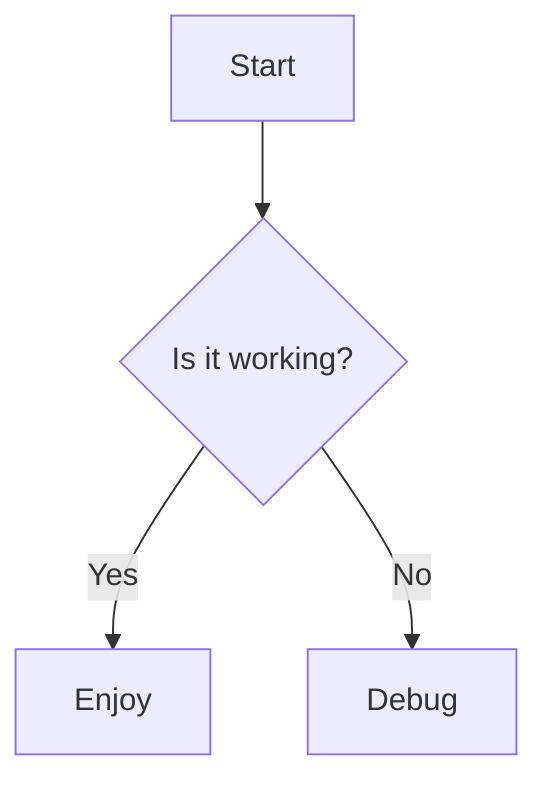

# Markdown Test Document

This is a simple test document to ensure Markdown rendering with syntax
highlighting and Mermaid diagrams renders correctly.

## Typography and Links

Text can be **bold**, *italic*, or ~~strikethrough~~. You can also use `backticks` for inline code.
Here is a [link](https://example.com) and an image:


## Lists and Tasks

- Unordered item 1
- Unordered item 2
    - Nested item A
    - Nested item B
1. Ordered item 1
2. Ordered item 2

- [x] Task finished
- [ ] Task pending

## Tables

| Header A | Header B | Header C |
| --- | --- | --- |
| Row 1 | Data | 100 |
| Row 2 | Data | 200 |
| Row 3 | Data | 300 |

## Blockquotes and Horizontal Rules

> Markdown is a lightweight markup language with plain-text-formatting syntax.
>
> — John Gruber

---

## Syntax Highlighting

```javascript
const x = 1;
```

## Mermaid Diagram


